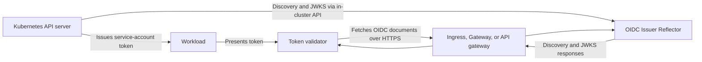

# Kubernetes OIDC Issuer Reflector

[](https://github.com/djr747/kube-oidc-issuer-reflector/actions/workflows/ci.yml)
[](https://github.com/djr747/kube-oidc-issuer-reflector/actions/workflows/security.yml)
[](https://codecov.io/gh/djr747/kube-oidc-issuer-reflector)

## Overview

Kubernetes OIDC Issuer Reflector is a small Flask service that makes a cluster's service-account issuer documents available to token validators. It reads the documents from the Kubernetes API server and serves them at an HTTPS issuer hostname on a public or private network. Validators can then discover the issuer and obtain its public signing keys to validate Kubernetes-issued service-account tokens.

The reflector serves these two document paths:

| Path | Document | Used for |
| --- | --- | --- |
| `/.well-known/openid-configuration` | OIDC discovery | Finding the issuer's metadata and JWKS URL. |
| `/openid/v1/jwks` | JSON Web Key Set (JWKS) | Verifying service-account token signatures. |

The service does not issue tokens, authenticate callers to the Kubernetes API, or change the issuer in a token. It is useful when a token validator needs the cluster's issuer documents but cannot access them through the Kubernetes API server. If validators can already fetch both documents directly, another reflector may be unnecessary.

## How it works



The API server must be configured so its service-account token issuer and JWKS URI point to the HTTPS hostname served by the route. The reflector returns the API server's validated documents without rewriting their issuer or keys. See [Getting Started](docs/getting-started.md#configure-the-kubernetes-issuer) for the API server settings and issuer migration considerations.

## When to use it

- **Workload identity federation:** An external identity provider can fetch the issuer documents to validate a Kubernetes service-account token. See the [Microsoft Entra federated workload identity example](docs/entra-id-federated-workload-identity.md).
- **External APIs:** An API outside the cluster can validate tokens presented by Kubernetes workloads against the issuer's public keys.
- **Private internal APIs:** Services in the cluster, on a corporate network, or across privately connected clusters can use standard OIDC discovery without receiving Kubernetes API credentials. Keep the issuer reachable only on those networks when all validators are internal.
- **Cross-cluster trust:** A service in another cluster can validate tokens from the issuing cluster when its trust configuration accepts that issuer. Expose the issuing cluster's documents to that validator.
- **Development and testing:** A test environment can exercise an external validator against a cluster's service-account issuer.

This service is not needed merely because a CI/CD system uses a service-account token to call the Kubernetes API; the API server validates those tokens itself.

## Public and private access

| Access pattern | DNS and routing | Suitable for |
| --- | --- | --- |
| Public | Issuer hostname resolves to a public HTTPS gateway. | Internet-based identity providers and other external validators. |
| Public and internal with split-horizon DNS | The same issuer hostname resolves to a public gateway externally and a private HTTPS gateway internally. | Internal and external validators sharing one issuer without routing internal requests through the public edge. |
| Private only | Issuer hostname resolves through private DNS to a private HTTPS gateway; no public listener is needed. | Internal APIs and validators reachable through a corporate network, VPN, or private interconnect. |

Split-horizon DNS is optional. Keep one issuer URL, such as `https://oidc.example.com`, in tokens, discovery metadata, and validator configuration; DNS changes the destination address, not the issuer identity. Each HTTPS listener needs a certificate for that hostname trusted by its callers. A private issuer works only for validators with network access to it. See [DNS and access patterns](docs/getting-started.md#dns-and-access-patterns) for setup details.

## Key capabilities

- **Document reflection:** Publishes Kubernetes' service-account discovery document and JWKS through two GET endpoints.
- **Upstream protection:** Validates and caches each document in memory per Gunicorn worker. By default, documents remain fresh for 30 seconds; a previously valid document can be served for up to 300 additional seconds during a Kubernetes API error or throttle response. A 5-second retry backoff limits repeated failed refreshes.
- **Request controls:** Applies a per-client, per-worker rate limit to the document endpoints and can require an exact `User-Agent` value when configured.
- **Kubernetes deployment:** Includes liveness and readiness probes, a Helm chart, a static deployment, and optional Ingress or Gateway API routes. The reflector's dedicated ServiceAccount and RBAC binding are configurable in Helm.
- **Operations:** Runs with Gunicorn and emits structured access logs. The deployment supplies resource limits and a restricted container security context.

## Get started

1. Configure an HTTPS service-account issuer and JWKS URI on the Kubernetes API server, reachable by every intended validator. Confirm that your Kubernetes distribution permits these settings.
2. Provide DNS, TLS, and a maintained Ingress, Gateway, or API gateway for the issuer hostname. The application does not terminate TLS or install a gateway controller.
3. Deploy the reflector with a published Helm chart version, then enable the route that matches your edge setup:

   ```bash
   helm upgrade --install kube-oidc-issuer-reflector \
     oci://ghcr.io/djr747/helm-charts/kube-oidc-issuer-reflector \
     --version X.Y.Z \
     --namespace kube-oidc-issuer-reflector --create-namespace
   ```

   This command installs the workload without an issuer route. Use [Getting Started](docs/getting-started.md#install-with-helm) for Helm values and route examples, or [deploy the static manifests](docs/getting-started.md#deploy-the-application).

4. Check both document paths from each intended network. If `ALLOWED_USER_AGENT` is set, send its configured value when checking them.

The Helm chart is distributed as an OCI package with the same release version as the application. See [Consuming the Helm chart](docs/RELEASE.md#consuming-the-helm-chart) for release and upgrade instructions.

## Configuration

The chart exposes application settings under `config` and `oidcDocumentCache`, along with deployment resources, probes, ServiceAccount/RBAC choices, and optional routes. These are the main application defaults:

| Environment variable | Default | Purpose |
| --- | --- | --- |
| `DEFAULT_RATE_LIMIT` | `10 per second` | Per-client, per-worker limit on the OIDC document endpoints. |
| `ALLOWED_USER_AGENT` | unset | Optional exact-match filter for the `User-Agent` header. |
| `KUBERNETES_REQUEST_TIMEOUT_SECONDS` | `5` | Timeout for each Kubernetes API request, in seconds. |
| `OIDC_DOCUMENT_CACHE_TTL_SECONDS` | `30` | Time a validated document stays fresh. |
| `OIDC_DOCUMENT_CACHE_STALE_IF_ERROR_SECONDS` | `300` | Extra time it may be served after an upstream error. |
| `OIDC_DOCUMENT_CACHE_ERROR_BACKOFF_SECONDS` | `5` | Delay before retrying a failed refresh when stale data is available. |

See [all application settings](docs/getting-started.md#configuration) and the [chart values](charts/kube-oidc-issuer-reflector/values.yaml) for the complete configuration. Each worker and replica keeps its own cache and rate-limit state; neither is shared across the deployment.

## Security and operational limits

The discovery document and JWKS contain issuer metadata and **public** signing keys, so they are intended to be reachable by token validators. Expose only those two paths at the selected gateway and terminate HTTPS there. For a private deployment, restrict network access to the intended callers. A `User-Agent` filter is useful for known clients but is not authentication; clients can set that header themselves.

The reflector needs an automounted ServiceAccount token to read the documents through the Kubernetes API. The Helm chart creates a dedicated ServiceAccount and RBAC binding by default; clusters using the standard issuer-discovery binding can disable those dedicated resources and use an existing ServiceAccount. See the [Helm ServiceAccount options](docs/getting-started.md#install-with-helm).

Rate limits and cache entries are local to each worker. Size the public edge for the traffic and abuse controls you need. Serving stale JWKS through an upstream outage can delay visibility of a newly rotated signing key; set the stale window to match your availability and key-rotation requirements. `/livez` checks process liveness, while `/readyz` checks that usable issuer documents are available.

## Container image

Release images are published to GitHub Container Registry:

```text
ghcr.io/djr747/kube-oidc-issuer-reflector:<version>
```

The Dockerfile uses Chainguard's public floating Python `latest` and `latest-dev` tags so base-image patch updates are picked up by the daily no-cache rebuild. Release images use exact version tags; a `develop` image is published after successful pushes to the `develop` branch.

## Project documentation

- [Getting Started](docs/getting-started.md): issuer setup, deployment, Helm values, and verification.
- [Development](docs/DEVELOPMENT.md): local setup and contributor checks.
- [Release Process](docs/RELEASE.md) and [workflow details](.github/WORKFLOWS.md): image and chart releases.
- [Troubleshooting](docs/troubleshooting.md): common deployment and issuer problems.
- [Changelog](CHANGELOG.md) and [GitHub Releases](https://github.com/djr747/kube-oidc-issuer-reflector/releases): version history.
- [Contributing](CONTRIBUTING.md) and [MIT License](LICENSE).
