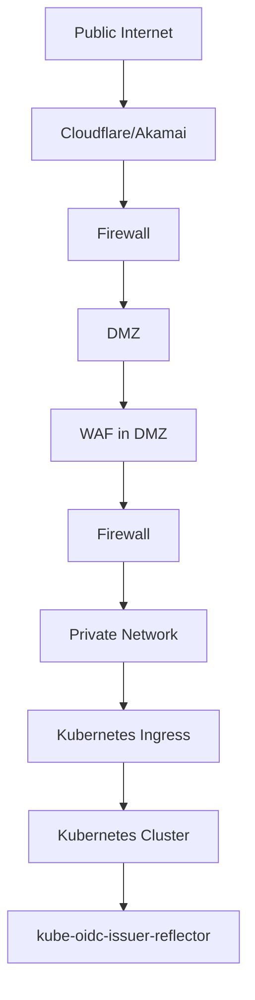

# End-to-End Example: Enabling Entra ID Federated Workload Identity on a Standard Kubernetes Cluster

This guide shows how to publish a self-managed Kubernetes cluster's service-account OIDC discovery document and JWKS for Microsoft Entra workload identity federation. The reflector reads those documents from the Kubernetes API and serves them at a public HTTPS hostname. It does not issue service-account tokens or choose their issuer. The example routes public requests through Cloudflare or Akamai, a WAF in a DMZ, and a Kubernetes Ingress; split DNS can route internal requests directly to the Ingress.

## Overview

The following diagram illustrates the architecture:



## Prerequisites

1. A Kubernetes cluster hosted in a data center.
2. Control of the API server's service-account issuer settings.
3. Access to Cloudflare or Akamai for public routing and a WAF in a DMZ.
4. A public FQDN for the issuer (for example, `reflector-cluster-name.kubernetes.example.com`).
5. Split DNS if internal clients should resolve that same FQDN to a private Ingress address.
6. A working Ingress controller, TLS certificates for each HTTPS hop, and firewall rules for the chosen route.

## Firewall Configuration

### Firewall Between Internet and DMZ

For a direct origin connection, configure the firewall to accept traffic to the WAF only from the edge provider in use. This restricts the network source; it does not authenticate HTTP clients.

### Example Firewall Rules

The following table provides an example of firewall rules to allow traffic from Cloudflare or Akamai to the DMZ and deny all other traffic:

| Rule | Source | Destination | Port | Action |
|------|--------|-------------|------|--------|
| 1 | Chosen edge provider IPs | DMZ WAF | 443 | Allow |
| 2 | Any | DMZ | 443 | Deny |

### Example Firewall Configuration

Keep the edge provider's published source IP ranges current. If using a tunnel instead, follow the tunnel provider's outbound connectivity requirements rather than these direct-origin rules.

### Firewall Between DMZ and Private Network

Configure the firewall to allow traffic from the WAF to the Kubernetes ingress. This ensures that only traffic from the WAF can reach the private network.

### Example Firewall Rules

1. Allow outbound traffic from the WAF to the Kubernetes ingress on port 443 (HTTPS).
2. Deny all other outbound traffic from the DMZ to the private network.

### Example Firewall Configuration

The following table provides an example of firewall rules to allow traffic from the WAF to the Kubernetes ingress and deny all other traffic:

| Rule | Source | Destination | Port | Action |
|------|--------|-------------|------|--------|
| 1 | WAF | Kubernetes Ingress | 443 | Allow |
| 2 | Any | Private Network | 443 | Deny |

## Optional tunnel route

A Cloudflare Tunnel can replace the direct edge-to-DMZ connection. Run the connector where it can reach the WAF, publish the issuer hostname, and configure the tunnel's origin service URL to point to the WAF. A DNS route alone does not tell the connector where to send requests. Keep TLS verification enabled for the origin and use [Cloudflare's tunnel configuration guide](https://developers.cloudflare.com/tunnel/features/locally-managed-tunnels/create-local-tunnel/) for the selected management mode. For Akamai, configure the corresponding origin connectivity feature supported by your Akamai product; this example does not assume a specific tunnel product.

## Step 1: Configure Split-DNS

Split DNS can resolve the issuer FQDN to a private Ingress address for internal clients while public DNS sends external clients through Cloudflare or Akamai. Microsoft Entra must be able to reach the public discovery and JWKS URLs.

### Example Split-DNS Configuration

- **Internal DNS**: Resolve `reflector-cluster-name.kubernetes.example.com` to the internal IP of the Kubernetes ingress.
- **External DNS**: Publish `reflector-cluster-name.kubernetes.example.com` through the chosen edge provider. Configure that provider's origin to reach the WAF, directly or through the optional tunnel.

## Step 2: Configure Cloudflare or Akamai

Configure Cloudflare or Akamai to route traffic to the WAF in the DMZ. Ensure that the traffic is routed securely using HTTPS.

### Example Cloudflare Configuration

1. Add the public FQDN (e.g., `reflector-cluster-name.kubernetes.example.com`) to Cloudflare.
2. Configure the public DNS record for the Cloudflare route and set the WAF as its origin.
3. Enable SSL/TLS encryption for secure communication.

## Step 3: Configure the WAF in the DMZ

The WAF in the DMZ should be configured to act as a reverse proxy, performing filtering and evaluation of incoming traffic before forwarding it to the Kubernetes ingress. This includes limiting specific URLs and calls, as well as applying security policies.

### Example WAF Configuration

1. Configure the WAF to allow traffic on port 443 (HTTPS).
2. Set up rules to filter and evaluate incoming traffic:
   - Allow only specific URLs and HTTP methods (e.g., GET only).
   - Block malicious payloads.
   - Apply rate limiting to prevent DDoS attacks.
3. Configure the WAF to forward traffic to the internal IP of the Kubernetes ingress.
4. Ensure that the WAF is configured to terminate SSL/TLS and forward traffic securely.
5. Preserve the client's `User-Agent` header when forwarding requests so the reflector's optional exact-match filter can evaluate it.

### Example WAF Rules

The following policies illustrate the intended outcome; configure their evaluation order for your WAF product:

| Traffic | Action |
|---------|--------|
| Malicious or malformed requests | Deny |
| Excessive issuer requests | Rate limit at a threshold sized for expected traffic |
| GET `/.well-known/openid-configuration` or GET `/openid/v1/jwks` | Allow after security checks |
| Other paths or methods | Deny |

## Step 4: Configure TLS for the issuer hostname

Configure TLS at every HTTPS hop in the selected route. The certificate presented for the issuer hostname must cover `reflector-cluster-name.kubernetes.example.com`. A certificate validates the hostname for TLS; it does not set the `issuer` field in the OIDC document.

This example's perimeter allows only port 443. For a cert-manager certificate issued by Let's Encrypt, use DNS-01 validation; HTTP-01 starts on port 80. The repository's [getting-started guide](getting-started.md#optional-install-cert-manager) shows how to install cert-manager and configure its optional Cloudflare DNS-01 `ClusterIssuer` named `cloudflare-issuer`. The Ingress created by Helm or the static manifest references that issuer and a TLS Secret; cert-manager creates the Certificate from the annotated Ingress. If using another DNS provider or an existing certificate authority, use its ready issuer and change the Ingress annotation accordingly. Keep the TLS Secret name consistent with the Ingress.

## Step 5: Configure the Kubernetes service-account issuer

Configure the API server to issue service-account tokens with the public HTTPS issuer and to publish a JWKS URL reachable by Entra. For a self-managed API server, the relevant settings are:

```text
--service-account-issuer=https://reflector-cluster-name.kubernetes.example.com
--service-account-jwks-uri=https://reflector-cluster-name.kubernetes.example.com/openid/v1/jwks
```

Apply these settings using your Kubernetes distribution's control-plane procedure, preserving its signing-key configuration. Changing the issuer changes the `iss` claim of newly issued tokens; plan a migration if existing tokens or relying parties still use the old issuer. The reflector serves the API server's discovery response unchanged, so the public route, the response's `issuer`, and the `jwks_uri` must agree. `--oidc-issuer-url` is for authenticating clients to the Kubernetes API and is not needed for this federation pattern.

Check the API server's source document before publishing it:

```bash
kubectl get --raw=/.well-known/openid-configuration
```

## Step 6: Choose the reflector ServiceAccount and RBAC

The reflector needs a mounted ServiceAccount token to read the API server's discovery and JWKS URLs. A dedicated ServiceAccount is optional: if `serviceAccountName` is omitted, Kubernetes assigns the namespace's `default` ServiceAccount. On a stock RBAC setup, the built-in `system:service-account-issuer-discovery` ClusterRoleBinding grants this access to all ServiceAccounts, so an additional binding is optional too.

The YAML below shows a dedicated account and binding for environments that require them. To use the namespace's default account with the stock discovery binding, omit both optional YAML resources and omit `serviceAccountName` from the static Deployment in Step 7. Keep token automount enabled. If using Helm, skip the YAML in this step: the chart creates a dedicated account and binding by default. Set `serviceAccount.create=false`, `serviceAccount.name=default`, and `rbac.create=false` in the Helm values to use the namespace's default account instead; the chart requires an explicit account name when it does not create one.

### Example Namespace Configuration

```yaml
apiVersion: v1
kind: Namespace
metadata:
  name: kube-oidc-issuer-reflector
```

### Optional dedicated ServiceAccount

```yaml
apiVersion: v1
kind: ServiceAccount
metadata:
  name: kube-oidc-issuer-reflector
  namespace: kube-oidc-issuer-reflector
```

### Optional dedicated discovery binding

```yaml
apiVersion: rbac.authorization.k8s.io/v1
kind: ClusterRoleBinding
metadata:
  name: kube-oidc-issuer-reflector-discovery
roleRef:
  apiGroup: rbac.authorization.k8s.io
  kind: ClusterRole
  name: system:service-account-issuer-discovery
subjects:
  - kind: ServiceAccount
    name: kube-oidc-issuer-reflector
    namespace: kube-oidc-issuer-reflector
```

The federated application uses its own ServiceAccount. Its name and namespace, not the reflector's, determine the federated credential subject in Step 9.

## Step 7: Deploy the reflector with Helm or static manifests

Choose one deployment method. The Helm chart installs the Deployment, Service, optional dedicated ServiceAccount and binding, and Ingress from one values file. The public issuer hostname is configured on the API server and the Ingress, not in the application container.

### Helm deployment

Save the following as `reflector-values.yaml`. The chart supplies the other deployment settings from its defaults. Its default image tag comes from the released chart's application version.

Replace the example `nginx` Ingress class with the actual class of your installed, maintained controller. The chart does not install that controller.

```yaml
config:
  allowedUserAgent: MS-STS
ingress:
  enabled: true
  className: nginx
  host: reflector-cluster-name.kubernetes.example.com
  annotations:
    cert-manager.io/cluster-issuer: cloudflare-issuer
  tls:
    enabled: true
    secretName: kube-oidc-issuer-reflector-tls
```

Install a published chart version matching the application release:

```bash
helm upgrade --install kube-oidc-issuer-reflector \
  oci://ghcr.io/djr747/helm-charts/kube-oidc-issuer-reflector \
  --version 1.2.0 \
  --namespace kube-oidc-issuer-reflector --create-namespace \
  --values reflector-values.yaml
```

The chart and image for this example will be published together as version `1.2.0`. Use these commands after that release is available. See [Consuming the Helm chart](RELEASE.md#consuming-the-helm-chart) for GHCR access and release artifacts. To use the namespace's default ServiceAccount instead, add this to the values file:

```yaml
serviceAccount:
  create: false
  name: default
rbac:
  create: false
```

For an unreleased chart from a repository checkout, replace the OCI reference and `--version 1.2.0` with `./charts/kube-oidc-issuer-reflector`. Also override `image.repository` and `image.tag` to select your built candidate image; the local chart's development metadata otherwise selects `latest`. Helm users can continue at Step 9; the chart creates the Service and Ingress shown below.

### Static Deployment alternative

This manifest uses the optional dedicated ServiceAccount from Step 6. Remove `serviceAccountName` to use the namespace's default account.

### Example Deployment Configuration

```yaml
apiVersion: apps/v1
kind: Deployment
metadata:
  name: kube-oidc-issuer-reflector
  namespace: kube-oidc-issuer-reflector
spec:
  replicas: 2
  selector:
    matchLabels:
      app: kube-oidc-issuer-reflector
  template:
    metadata:
      labels:
        app: kube-oidc-issuer-reflector
    spec:
      serviceAccountName: kube-oidc-issuer-reflector
      containers:
      - name: kube-oidc-issuer-reflector
        image: ghcr.io/djr747/kube-oidc-issuer-reflector:1.2.0
        env:
        - name: ALLOWED_USER_AGENT
          value: "MS-STS"
        ports:
        - containerPort: 8080
        resources:
          requests:
            memory: "128Mi"
            cpu: "250m"
            ephemeral-storage: "10Mi"
          limits:
            memory: "512Mi"
            cpu: "500m"
            ephemeral-storage: "1Gi"
        livenessProbe:
          httpGet:
            path: /livez
            port: 8080
          initialDelaySeconds: 10
          timeoutSeconds: 2
          periodSeconds: 30
          failureThreshold: 2
        readinessProbe:
          httpGet:
            path: /readyz
            port: 8080
          initialDelaySeconds: 5
          timeoutSeconds: 3
          periodSeconds: 30
          failureThreshold: 3
      automountServiceAccountToken: true
```

Both deployment methods above accept discovery and JWKS requests only when the `User-Agent` header is exactly `MS-STS`. If your clients use another value, change the setting to match; omit it to allow any user agent. The header is supplied by the client, so this filter is not authentication.

## Step 8: Create Service and Ingress for the static deployment

Skip this step when using Helm. For the static Deployment, create a Service and Ingress to expose the reflector through the chosen edge route.

### Example Service Configuration

```yaml
apiVersion: v1
kind: Service
metadata:
  name: kube-oidc-issuer-reflector
  namespace: kube-oidc-issuer-reflector
spec:
  selector:
    app: kube-oidc-issuer-reflector
  ports:
  - protocol: TCP
    port: 80
    targetPort: 8080
  type: ClusterIP
```

### Example Ingress Configuration

```yaml
apiVersion: networking.k8s.io/v1
kind: Ingress
metadata:
  name: kube-oidc-issuer-reflector
  namespace: kube-oidc-issuer-reflector
  annotations:
    cert-manager.io/cluster-issuer: "cloudflare-issuer"
spec:
  ingressClassName: nginx
  rules:
  - host: reflector-cluster-name.kubernetes.example.com
    http:
      paths:
        - path: /.well-known/openid-configuration
          pathType: Exact
          backend:
            service:
              name: kube-oidc-issuer-reflector
              port:
                number: 80
        - path: /openid/v1/jwks
          pathType: Exact
          backend:
            service:
              name: kube-oidc-issuer-reflector
              port:
                number: 80
  tls:
    - hosts:
        - reflector-cluster-name.kubernetes.example.com
      secretName: kube-oidc-issuer-reflector-tls
```

## Step 9: Configure Entra federated identity credentials

Configure an Entra application or user-assigned managed identity to trust tokens from the Kubernetes ServiceAccount used by the federated workload. The reflector ServiceAccount only reads OIDC documents; it is not the subject of this credential unless it is also the workload receiving Entra tokens.

### Example Entra ID Configuration

1. Create or select the Entra application or user-assigned managed identity that the workload will use.
2. Add a federated identity credential with issuer `https://reflector-cluster-name.kubernetes.example.com`. It must exactly match the `iss` claim in the workload's projected Kubernetes token and the discovery document's `issuer` value.
3. Set its subject to `system:serviceaccount:<workload-namespace>:<workload-service-account>`, matching the ServiceAccount used by the application pod.
4. Choose the audience required by your token exchange flow. Configure the workload's projected service-account token with the same audience; Entra checks that the credential audience matches the token's `aud` claim. The reflector does not set this audience.
5. Grant the Entra identity access to the Azure resource the workload needs, then configure the workload to exchange its projected token using an SDK or other supported client.

## Step 10: Test the configuration

Run the endpoint commands from an internal host and again from an external host to check each DNS route. Use the user agent configured in Step 7. Confirm that the discovery response has the expected `issuer` and public `jwks_uri`, and that the JWKS response contains signing keys.

### Example Test Commands

1. Test the discovery document:

```bash
curl --fail --show-error --user-agent MS-STS \
  https://reflector-cluster-name.kubernetes.example.com/.well-known/openid-configuration
```

2. Test the JWKS document:

```bash
curl --fail --show-error --user-agent MS-STS \
  https://reflector-cluster-name.kubernetes.example.com/openid/v1/jwks
```

3. Inspect the presented certificate chain:

```bash
openssl s_client -connect reflector-cluster-name.kubernetes.example.com:443 \
  -servername reflector-cluster-name.kubernetes.example.com -showcerts
```

## Documentation Links

- [kube-oidc-issuer-reflector GitHub Repository](https://github.com/djr747/kube-oidc-issuer-reflector)
- [Cloudflare Documentation](https://developers.cloudflare.com/)
- [Akamai Documentation](https://developer.akamai.com/)
- [Kubernetes service-account issuer discovery](https://kubernetes.io/docs/tasks/configure-pod-container/configure-service-account/#service-account-issuer-discovery)
- [Kubernetes Ingress documentation](https://kubernetes.io/docs/concepts/services-networking/ingress/)
- [Microsoft Entra federated identity credentials for Kubernetes](https://learn.microsoft.com/en-us/entra/workload-id/workload-identity-federation-create-trust)
- [cert-manager annotated Ingress](https://cert-manager.io/docs/usage/ingress/)
- [Cloudflare Tunnel documentation](https://developers.cloudflare.com/tunnel/features/locally-managed-tunnels/create-local-tunnel/)

## Conclusion

The reflector publishes the Kubernetes service-account issuer documents for external token validation. The issuer and JWKS URLs, edge route, TLS certificate, and Entra federated credential must describe the same issuer. Verify the public responses and the workload's token exchange before relying on the setup.
