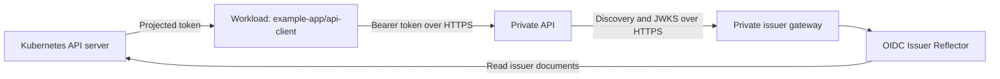

# Example: Kubernetes workloads authenticating to a private API

A private API can accept short-lived Kubernetes ServiceAccount tokens and validate them using the reflector's discovery document and public signing keys. The API can run on a corporate network or in another privately connected cluster. It needs access to the issuer's HTTPS endpoints, without needing credentials for the issuing cluster's Kubernetes API.

This example authorizes one workload identity to call one API. All hostnames are reserved examples; replace them with your own DNS names and infrastructure settings.

The implementation assumes you control the workload's Pod specification and the private API's validator configuration. The Pod explicitly requests a short-lived ServiceAccount token for this API through a projected volume. The API accepts that audience and authorizes the namespace and ServiceAccount encoded in the verified `sub` claim. It does not use the ordinary automounted Kubernetes API token or a legacy Secret-based token.

## Architecture and trust



| Setting | Example |
| --- | --- |
| Issuer | `https://oidc.internal.example.com` |
| JWKS URL | `https://oidc.internal.example.com/openid/v1/jwks` |
| API audience | `https://api.internal.example.com` |
| Authorized subject | `system:serviceaccount:example-app:api-client` |

The namespace and ServiceAccount name form the workload identity: `system:serviceaccount:example-app:api-client`. The API compares that exact `sub` value only after verifying the signature and token claims. Kubernetes RBAC does not automatically authorize access to this application API.

| Check | Purpose in this implementation |
| --- | --- |
| Signature and configured signing algorithm | Establish that the trusted cluster signed the token. |
| `iss` | Accept tokens only from the configured cluster issuer. |
| `exp`, `nbf` and `iat` | Check expiry and time validity, including future issuance. |
| `aud` | Accept a token intended for this private API. |
| `sub` | Authorize the selected namespace and ServiceAccount. |

Audience identifies the intended recipient; it does not grant access or select the workload identity. Another ServiceAccount can request the same audience and still be rejected by the subject policy.

The API must validate the issuer gateway's TLS certificate chain to a trusted root, its validity dates and its hostname before accepting discovery or JWKS. If verification is bypassed or the trust store is compromised, an attacker able to intercept that connection could supply substitute keys and forge tokens with matching issuer, audience and subject claims. Configure a private CA through a trusted administrative process. See [TLS trust boundaries](getting-started.md#tls-trust-boundaries).

## 1. Prepare the private issuer

Follow [issuer configuration](getting-started.md#configure-the-kubernetes-issuer) using:

```text
--service-account-issuer=https://oidc.internal.example.com
--service-account-jwks-uri=https://oidc.internal.example.com/openid/v1/jwks
```

Keep the existing signing-key configuration. Changing an established issuer requires a migration for existing tokens and validators. Resolve the issuer hostname through private DNS to a maintained internal Ingress controller, and provide a TLS certificate for that hostname. The API must trust its certificate chain. The API's own HTTPS hostname needs its own TLS configuration.

Use [split-horizon DNS](getting-started.md#public-and-internal-access-with-split-horizon-dns) if external validators also use this issuer: keep the same issuer URL in both DNS views. A private-only deployment needs no public listener.

Save this as `private-api-issuer-values.yaml`, replacing `internal` with the installed private Ingress class. Provision `issuer-tls` in the reflector namespace before installing; this chart does not issue certificates.

```yaml
config:
  allowedUserAgent: example-api-validator
ingress:
  enabled: true
  className: internal
  host: oidc.internal.example.com
  tls:
    enabled: true
    secretName: issuer-tls
```

Install the released chart:

```bash
helm upgrade --install kube-oidc-issuer-reflector \
  oci://ghcr.io/djr747/helm-charts/kube-oidc-issuer-reflector \
  --version 1.2.1 \
  --namespace kube-oidc-issuer-reflector --create-namespace \
  --values private-api-issuer-values.yaml
```

Version 1.2.1 is available after its release is published. To preview from a repository checkout before publication, use `./charts/kube-oidc-issuer-reflector` instead of the OCI reference, omit `--version`, and set `image.repository` and `image.tag` to your built candidate image. The unpackaged chart requires an explicit tag.

The reflector's dedicated ServiceAccount and discovery binding are optional, independently configurable resources. To use the namespace's default account on a cluster with the stock discovery binding, add `serviceAccount.create=false`, `serviceAccount.name=default`, and `rbac.create=false` to the values; keep token automount enabled. The workload account below is a separate identity.

## 2. Project a token for the API audience

The audience is requested in the **Pod's projected volume**, under `serviceAccountToken.audience`. It is not a field on the ServiceAccount. Kubelet uses the TokenRequest API to obtain a signed token with that audience and mounts it for the workload. In this example, the requested audience must match the API's `API_AUDIENCE` setting. See [Kubernetes token projection](https://kubernetes.io/docs/concepts/storage/projected-volumes/#serviceaccounttoken).

Audiences do **not** need to be hostnames or reachable URLs. They are case-sensitive identifiers agreed by the token requester and receiving service. Kubernetes includes the requested identifier in the signed token without resolving it or contacting a service at that address. Valid naming choices include:

| Audience identifier | Naming choice |
| --- | --- |
| `inventory-api` | A simple service identifier. |
| `urn:example:internal-platform` | A logical identifier shared by an explicitly trusted service group. |
| `https://api.internal.example.com` | A URL-shaped identifier, as used in this example. |

For this API, you could instead choose `private-api` by setting both the Pod's `serviceAccountToken.audience` and the API's `API_AUDIENCE` to that exact value. The actual API address, issuer URL and JWKS URL would remain unchanged; those are separate HTTPS endpoints with their own DNS and TLS requirements. External identity providers may require a particular audience value, so follow the receiving provider's contract. See the [JWT audience claim definition](https://www.rfc-editor.org/rfc/rfc7519.html#section-4.1.3).

The ordinary automounted token normally targets the Kubernetes API; omitting the audience from an explicit projection also defaults it to the API server's audience. Using that token unchanged does not implement this example. Legacy Secret-based tokens can lack an audience and expiry and are also outside this scenario. This example requires an explicit projection; it does not change the API server's accepted `--api-audiences` or the reflector's own token.

Save the following workload pattern as `api-client.yaml`. Replace the container image with your application image. The application reads the mounted token when making requests; kubelet rotates the projected file, so do not retain its contents indefinitely.

```yaml
apiVersion: v1
kind: Namespace
metadata:
  name: example-app
---
apiVersion: v1
kind: ServiceAccount
metadata:
  name: api-client
  namespace: example-app
automountServiceAccountToken: false
---
apiVersion: v1
kind: Pod
metadata:
  name: api-client
  namespace: example-app
spec:
  serviceAccountName: api-client
  automountServiceAccountToken: false
  containers:
    - name: application
      image: registry.example.com/team/api-client:VERSION
      volumeMounts:
        - name: api-token
          mountPath: /var/run/secrets/private-api
          readOnly: true
  volumes:
    - name: api-token
      projected:
        sources:
          - serviceAccountToken:
              # Requested recipient; must match API_AUDIENCE in the private API.
              audience: https://api.internal.example.com
              expirationSeconds: 600
              path: token
```

```bash
kubectl apply -f api-client.yaml
```

Disabling the ordinary token automount does not disable this explicitly projected volume. The workload needs no RoleBinding for the private API. Its deployment operator needs permission to create these resources; the reflector keeps its own API-access permissions.

### Calling multiple external services

An audience belongs to an issued token. A Pod can obtain several tokens for the same ServiceAccount, each with its own audience; the Pod and ServiceAccount are not limited to one external service.

For example, to call this private API and an inventory API, replace the `volumes` entry above with the following. Keep the existing `api-token` volume mount. Kubelet requests and rotates both tokens, placing them in separate files:

```yaml
volumes:
  - name: api-token
    projected:
      sources:
        - serviceAccountToken:
            audience: https://api.internal.example.com
            expirationSeconds: 600
            path: token
        - serviceAccountToken:
            audience: https://inventory.internal.example.com
            expirationSeconds: 600
            path: inventory-token
```

The application reads `/var/run/secrets/private-api/token` for this API and `/var/run/secrets/private-api/inventory-token` for the inventory API. Both tokens identify `system:serviceaccount:example-app:api-client`. Each receiving API checks its own configured audience and independently authorizes that subject. Read the selected file again for later requests so rotation takes effect. Separate tokens prevent a token presented to one service from also being accepted by the other when their audience policies are distinct. See [Kubernetes projected volumes](https://kubernetes.io/docs/concepts/storage/projected-volumes/#serviceaccounttoken).

Other trust models are possible:

| Requirement | Approach |
| --- | --- |
| Several known services with distinct trust boundaries | Configure a separate token projection for each audience. |
| Services intentionally sharing one recipient identity | Configure a shared logical audience, such as `urn:example:internal-platform`, on the projection and all intended validators. An audience need not be a URL or identify only one endpoint. A token can then be reused across that group, so all recipients must be trusted with it. |
| One token accepted by several distinct audiences | Request a token through the TokenRequest API with several entries in `spec.audiences`. The projected-volume `audience` field accepts a single string. A token with multiple audiences can be reused at every listed recipient; Kubernetes documents the trust implications in the [TokenRequest API definition](https://github.com/kubernetes/api/blob/master/authentication/v1/types.go#L182). |
| Recipients selected dynamically at runtime | An authorized application or credential helper can use TokenRequest to request the needed audience. This requires Kubernetes API credentials and authorization to create tokens for the intended ServiceAccount, plus expiry handling and renewal. It adds permissions beyond the projection-only workload shown here. |

The audience is an identifier agreed by the recipient and token requester. Kubernetes does not contact or register the remote service to issue the token. Whatever model is chosen, audience matching supplements signature, issuer, lifetime and subject checks; it does not grant application permissions.

## 3. Validate and authorize tokens in the API

The following small Flask example validates RS256 tokens, including signature, issuer, audience, expiry and required claims, before checking the subject. It fetches discovery from a configured URL, checks the advertised issuer and JWKS URL against configured values, and never chooses a trusted issuer or algorithm from an incoming token.

Install the example's dependencies in a separate virtual environment:

```bash
python3 -m venv .venv-private-api
.venv-private-api/bin/python -m pip install Flask 'PyJWT[crypto]' requests
```

Save as `private_api.py`:

```python
import os
import ssl

import jwt
import requests
from flask import Flask, jsonify, request

ISSUER = os.environ["OIDC_ISSUER"]
AUDIENCE = os.environ["API_AUDIENCE"]
SUBJECT = os.environ["AUTHORIZED_SUBJECT"]
JWKS_URI = f"{ISSUER}/openid/v1/jwks"
CA_FILE = os.environ.get("OIDC_CA_FILE")
HEADERS = {"User-Agent": "example-api-validator"}

response = requests.get(
    f"{ISSUER}/.well-known/openid-configuration",
    headers=HEADERS,
    timeout=5,
    verify=CA_FILE or True,
)
response.raise_for_status()
metadata = response.json()
if metadata.get("issuer") != ISSUER or metadata.get("jwks_uri") != JWKS_URI:
    raise RuntimeError("Discovery metadata does not match the configured issuer")

keys = jwt.PyJWKClient(
    JWKS_URI,
    headers=HEADERS,
    timeout=5,
    lifespan=30,
    ssl_context=ssl.create_default_context(cafile=CA_FILE),
)
app = Flask(__name__)


@app.get("/example")
def example():
    scheme, _, token = request.headers.get("Authorization", "").partition(" ")
    if scheme.lower() != "bearer" or not token:
        return jsonify(error="Bearer token required"), 401
    try:
        signing_key = keys.get_signing_key_from_jwt(token)
        claims = jwt.decode(
            token,
            signing_key.key,
            algorithms=["RS256"],
            issuer=ISSUER,
            audience=AUDIENCE,  # Matches the Pod's serviceAccountToken.audience.
            options={"require": ["exp", "iat", "nbf", "iss", "aud", "sub"]},
        )
    except jwt.PyJWKClientConnectionError:
        return jsonify(error="Issuer keys unavailable"), 503
    except (jwt.InvalidTokenError, jwt.PyJWKClientError) as _error:
        return jsonify(error="Invalid token"), 401
    # Authorize the namespace and ServiceAccount in the verified subject.
    if claims["sub"] != SUBJECT:
        return jsonify(error="Workload is not authorized"), 403
    return jsonify(message="Authorized Kubernetes workload")
```

Configure the API process:

```bash
export OIDC_ISSUER=https://oidc.internal.example.com
export API_AUDIENCE=https://api.internal.example.com
export AUTHORIZED_SUBJECT=system:serviceaccount:example-app:api-client
# For a private issuer CA, also set OIDC_CA_FILE to its PEM CA bundle.
.venv-private-api/bin/flask --app private_api run --host 127.0.0.1 --port 8081
```

The Flask development server is for local validation. Deploy the API using your normal production server behind private HTTPS routing to `api.internal.example.com`. The issuer must use RS256 for this example; for a different signing algorithm, configure an explicit supported algorithm appropriate to that cluster. Do not disable TLS or signature verification.

The example's User-Agent matches the Helm setting for both discovery and JWKS requests. That header is filtering, not authentication. If multiple validators need different User-Agents, leave `config.allowedUserAgent` empty or provide routing that accommodates them.

## 4. Call and verify the API

Use this request pattern inside your workload, with `requests` and the API's trusted CA available:

```python
from pathlib import Path

import requests

token = Path("/var/run/secrets/private-api/token").read_text().strip()
response = requests.get(
    "https://api.internal.example.com/example",
    headers={"Authorization": f"Bearer {token}"},
    timeout=5,
)
response.raise_for_status()
```

Read the token again for later requests so rotations take effect. For private API certificates, configure the client's trust bundle, for example through `REQUESTS_CA_BUNDLE`.

From the API's network, check issuer access using the configured User-Agent. Add `--cacert issuer-ca.pem` when the issuer uses a private CA:

```bash
curl --fail --show-error --user-agent example-api-validator \
  https://oidc.internal.example.com/.well-known/openid-configuration
curl --fail --show-error --user-agent example-api-validator \
  https://oidc.internal.example.com/openid/v1/jwks
```

Verify the following outcomes using test workloads and genuine signed tokens. Keep tokens out of logs.

| Request | Expected response |
| --- | --- |
| Valid token for `example-app/api-client`, issued for `https://api.internal.example.com` | `200` |
| Otherwise valid token for another namespace or ServiceAccount, with the expected issuer and audience | `403` |
| Token for the same authorized ServiceAccount, requested for another recipient such as `https://other-api.internal.example.com` | `401` |
| Missing, expired or incorrectly signed token | `401` |
| Signing keys unavailable with no usable client cache | `503` |

For the wrong-audience case, have a test Pod request a token for the other recipient using a separate projection, then present that token to this API. Its namespace and ServiceAccount can match the allowed subject, but its `aud` does not include this API. Do not edit an existing JWT payload to change `aud`: that also invalidates its signature and would test a different failure.

JWT validation uses the token's signature and claims. It does not query Kubernetes to check whether the bound Pod or ServiceAccount has since been deleted, so deletion is not immediate revocation for this API. Use short-lived tokens and choose a validation method using Kubernetes TokenReview if live object/revocation checks are required. The API's JWKS cache and reflector's per-worker document cache are separate; account for both when planning signing-key rotation.

For certificate renewal and expiry alerts, see [TLS certificate renewal and signing-key rotation](getting-started.md#tls-certificate-renewal-and-signing-key-rotation). The private issuer gateway's HTTPS certificate must remain valid for discovery and JWKS refresh; the API's HTTPS certificate protects workload requests. Kubernetes' raw public signing keys have no certificate expiry date.

## References

- [Kubernetes ServiceAccount token projection and issuer discovery](https://kubernetes.io/docs/tasks/configure-pod-container/configure-service-account/)
- [PyJWT validation API](https://pyjwt.readthedocs.io/en/stable/api.html)
- [PyJWT JWKS client behavior](https://pyjwt.readthedocs.io/en/stable/usage.html#retrieve-rsa-signing-keys-from-a-jwks-endpoint)
- [OIDC discovery metadata validation](https://openid.net/specs/openid-connect-discovery-1_0.html#ProviderConfigurationValidation)
