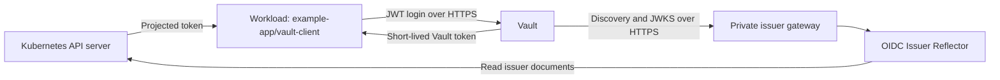

# Example: Kubernetes workloads authenticating to Vault with JWTs

Vault can authenticate a Kubernetes workload by validating its projected ServiceAccount token against the reflector's issuer discovery and JWKS endpoints. This suits a Vault server on a corporate network or in another privately connected cluster, with private HTTPS access to the issuer.

Use Vault's **JWT auth method** with a `jwt` role. Vault's Kubernetes auth method uses Kubernetes TokenReview and has different connectivity and permission requirements. The reflector supplies issuer documents for JWT validation; it does not implement a browser login flow or issue Vault tokens.

## Architecture and prerequisites



Prepare an existing Vault server reachable at `https://vault.internal.example.com`, an operator authorized to configure a dedicated auth mount and policy, and a Kubernetes cluster whose service-account issuer can be configured. These are reserved example hostnames. Vault must resolve `oidc.internal.example.com`, reach its HTTPS route, and trust its TLS certificate. Workloads must separately reach and trust Vault.

This example uses RS256-signed Kubernetes tokens, issuer `https://oidc.internal.example.com`, audience `https://vault.internal.example.com`, and subject `system:serviceaccount:example-app:vault-client`. The audience is chosen for this Vault role; it is not a universal audience for Kubernetes or other federation providers.

The audience does not need to be Vault's hostname or a URL. For example, `vault-workloads` could be used by setting both the Pod's projected-token audience and the Vault role's `bound_audiences` to that exact identifier. Kubernetes does not resolve or contact the audience identifier. The Vault listener address and OIDC issuer/JWKS URLs remain separate HTTPS endpoints. See [audience naming choices](private-api-authentication.md#2-project-a-token-for-the-api-audience); other federation providers may require specific audience values.

The workload requests this audience in its Pod's explicit `serviceAccountToken` projection; it is not configured on the ServiceAccount. Vault checks that intended recipient as well as the namespace and ServiceAccount in the subject. The ordinary automounted Kubernetes API token does not implement this projection. See [Kubernetes token projection](https://kubernetes.io/docs/concepts/storage/projected-volumes/#serviceaccounttoken).

Vault must verify the issuer endpoint's certificate chain and hostname before trusting its discovery and JWKS, and workloads must independently verify Vault's HTTPS endpoint before sending tokens. If issuer verification is bypassed or CA trust is compromised, an interceptor could substitute signing keys and forge tokens that satisfy the role's claims. Provision private CA trust securely and retain verification on proxy-to-origin connections. See [TLS trust boundaries](getting-started.md#tls-trust-boundaries).

## 1. Deploy the private issuer with Helm

Configure the API server through your distribution's supported procedure, preserving its signing-key configuration:

```text
--service-account-issuer=https://oidc.internal.example.com
--service-account-jwks-uri=https://oidc.internal.example.com/openid/v1/jwks
```

See [issuer configuration and migration](getting-started.md#configure-the-kubernetes-issuer) before changing an existing issuer. Point private DNS at a maintained private Ingress controller. Provision an `issuer-tls` Secret in the reflector namespace with a certificate for `oidc.internal.example.com`.

Save as `vault-issuer-values.yaml`. Replace `internal` with your installed private Ingress class:

```yaml
config:
  allowedUserAgent: ""
ingress:
  enabled: true
  className: internal
  host: oidc.internal.example.com
  tls:
    enabled: true
    secretName: issuer-tls
```

```bash
helm upgrade --install kube-oidc-issuer-reflector \
  oci://ghcr.io/djr747/helm-charts/kube-oidc-issuer-reflector \
  --version 1.2.1 \
  --namespace kube-oidc-issuer-reflector --create-namespace \
  --values vault-issuer-values.yaml
```

Version 1.2.1 is available after publication. For an unreleased checkout, use `./charts/kube-oidc-issuer-reflector`, omit `--version`, and override `image.repository` and `image.tag` with your candidate image. DNS, certificates and the private controller are provisioned separately from the chart.

Leave the User-Agent filter unset for this Vault example: the JWT auth configuration does not expose a custom discovery/JWKS User-Agent setting. An Entra-only or private-API-specific filter can reject Vault's requests. If sharing an existing reflector, update its values to allow all intended validators; do not install a second release with the same issuer route. Use [split-horizon DNS](getting-started.md#public-and-internal-access-with-split-horizon-dns) when that issuer also serves public validators.

The reflector's dedicated ServiceAccount and RBAC binding remain independent options. On a cluster with the stock discovery binding, `serviceAccount.create=false`, `serviceAccount.name=default`, and `rbac.create=false` use the namespace's default account; keep token automount enabled. The workload's `vault-client` account below is separate.

## 2. Configure Vault's JWT trust and policy

Run these operator commands against the intended Vault server:

```bash
export VAULT_ADDR=https://vault.internal.example.com
# For a private Vault CA, also set VAULT_CACERT to the CA bundle path.
vault auth enable -path=kubernetes-jwt jwt
vault write auth/kubernetes-jwt/config \
  oidc_discovery_url=https://oidc.internal.example.com \
  bound_issuer=https://oidc.internal.example.com \
  jwt_supported_algs=RS256
```

Authenticate the Vault CLI through your normal operator login first. Enable the auth mount only if it does not already exist; use a dedicated mount so an existing auth configuration is not replaced. `oidc_discovery_url` is the issuer base URL, not the `/.well-known/openid-configuration` path. No OIDC client ID, client secret or redirect URI is needed for this JWT role.

For an issuer using a private CA, include the issuer CA in the same configuration command:

```bash
vault write auth/kubernetes-jwt/config \
  oidc_discovery_url=https://oidc.internal.example.com \
  bound_issuer=https://oidc.internal.example.com \
  jwt_supported_algs=RS256 \
  oidc_discovery_ca_pem=@issuer-ca.pem
```

`VAULT_CACERT` configures the CLI's trust of Vault. `oidc_discovery_ca_pem` configures Vault's trust of the issuer; they are different connections.

Use a KV version 2 secrets engine mounted at `kv`, and provision a demonstration value at `example-app/config` through your usual operator process. If creating a new demonstration mount, the operator can run:

```bash
vault secrets enable -path=kv kv-v2
vault kv put -mount=kv example-app/config message="example value"
```

Skip mount creation if that path already holds the intended KV v2 engine. Save this least-privilege policy as `example-app-read.hcl`:

```hcl
path "kv/data/example-app/config" {
  capabilities = ["read"]
}
```

```bash
vault policy write example-app-read example-app-read.hcl
vault write auth/kubernetes-jwt/role/example-app \
  role_type=jwt \
  user_claim=sub \
  bound_subject=system:serviceaccount:example-app:vault-client \
  bound_audiences=https://vault.internal.example.com \
  token_policies=example-app-read \
  token_no_default_policy=true \
  token_type=batch \
  token_ttl=5m \
  token_explicit_max_ttl=5m
```

The role admits only the configured issuer, workload subject and audience. Its Vault token permits the selected secret read. Create separate roles and policies for other workloads. Batch tokens are not renewable; the workload performs JWT login again when it needs a new Vault token.

## 3. Project the workload token

Save this pattern as `vault-client.yaml`, replacing the image with your application image:

```yaml
apiVersion: v1
kind: Namespace
metadata:
  name: example-app
---
apiVersion: v1
kind: ServiceAccount
metadata:
  name: vault-client
  namespace: example-app
automountServiceAccountToken: false
---
apiVersion: v1
kind: Pod
metadata:
  name: vault-client
  namespace: example-app
spec:
  serviceAccountName: vault-client
  automountServiceAccountToken: false
  containers:
    - name: application
      image: registry.example.com/team/vault-client:VERSION
      volumeMounts:
        - name: vault-token
          mountPath: /var/run/secrets/vault-identity
          readOnly: true
  volumes:
    - name: vault-token
      projected:
        sources:
          - serviceAccountToken:
              audience: https://vault.internal.example.com
              expirationSeconds: 600
              path: token
```

```bash
kubectl apply -f vault-client.yaml
```

The explicit projected volume works with ordinary token automount disabled. This workload does not need a TokenReview permission or a Kubernetes RoleBinding to read Vault secrets. Vault's JWT validation needs issuer HTTPS access, while the reflector retains its own Kubernetes API access.

## 4. Log in and read the authorized secret

With `requests` available in your application, use this request pattern. Configure `REQUESTS_CA_BUNDLE` when the Vault listener uses a private CA:

```python
from pathlib import Path

import requests

vault_url = "https://vault.internal.example.com"
workload_jwt = Path("/var/run/secrets/vault-identity/token").read_text().strip()
login = requests.post(
    f"{vault_url}/v1/auth/kubernetes-jwt/login",
    json={"role": "example-app", "jwt": workload_jwt},
    timeout=5,
)
login.raise_for_status()
vault_token = login.json()["auth"]["client_token"]
secret = requests.get(
    f"{vault_url}/v1/kv/data/example-app/config",
    headers={"X-Vault-Token": vault_token},
    timeout=5,
)
secret.raise_for_status()
configuration = secret.json()["data"]["data"]
```

Read the projected JWT again for subsequent logins to pick up kubelet's rotations. Keep both token types and secret values out of logs. Vault Enterprise namespaces require the corresponding namespace configuration/header for these operator and workload requests; this example uses the root namespace.

## Verification and operating behavior

From Vault's network, check the issuer's discovery and JWKS over HTTPS. Add `--cacert issuer-ca.pem` for a private issuer CA:

```bash
curl --fail --show-error \
  https://oidc.internal.example.com/.well-known/openid-configuration
curl --fail --show-error \
  https://oidc.internal.example.com/openid/v1/jwks
```

Verify the allowed workload can log in and read the selected secret, while wrong-subject and wrong-audience tokens are rejected. Its Vault token must not read a different secret path. If login fails, check the exact issuer, subject and audience, Vault's TLS trust of the issuer, and any existing User-Agent filter.

JWT auth checks the signature and claims without TokenReview. Deleting a Pod or ServiceAccount does not immediately revoke an otherwise valid JWT for Vault, and a Vault token already issued has its own lifetime. Keep both lifetimes appropriate for the workload; use Vault's Kubernetes auth method when TokenReview semantics are needed. Vault's signing-key cache and the reflector's per-worker cache are separate; allow for key rotation and bounded stale JWKS during upstream outages.

Monitor renewal of both the issuer gateway's HTTPS certificate and Vault's HTTPS certificate. Expiry can prevent Vault from refreshing issuer keys or workloads from logging in and reading secrets. Kubernetes' raw JWKS keys have no certificate expiry date. See [TLS certificate renewal and signing-key rotation](getting-started.md#tls-certificate-renewal-and-signing-key-rotation).

## References

- [Vault JWT authentication](https://developer.hashicorp.com/vault/docs/auth/jwt)
- [Vault JWT configuration and role API](https://developer.hashicorp.com/vault/api-docs/auth/jwt)
- [Vault Kubernetes auth and JWT trade-offs](https://developer.hashicorp.com/vault/docs/auth/kubernetes#use-jwt-auth)
- [Vault KV v2 API](https://developer.hashicorp.com/vault/api-docs/secret/kv/kv-v2)
- [Kubernetes ServiceAccount projection](https://kubernetes.io/docs/tasks/configure-pod-container/configure-service-account/)
